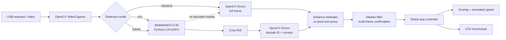
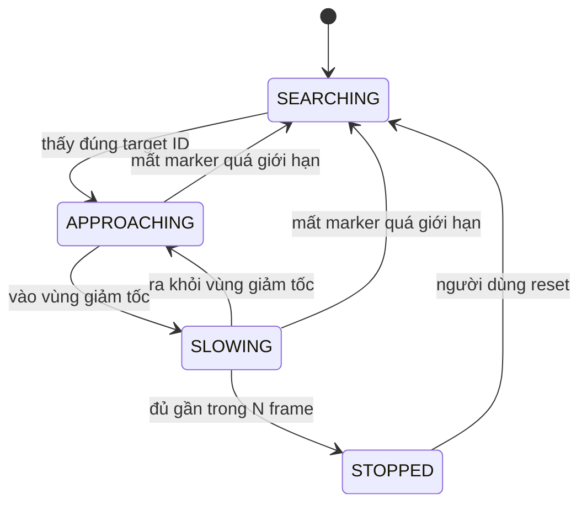
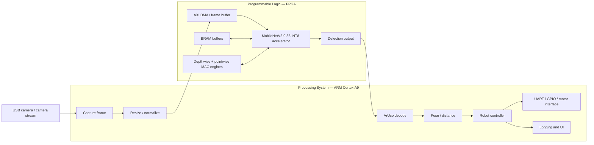

# Tổng quan hệ thống nhận diện ArUco cho robot giao hàng indoor

## 1. Giới thiệu

Hệ thống được xây dựng nhằm hỗ trợ robot giao hàng trong nhà nhận biết marker
ArUco đặt tại các phòng, xác định marker đích, ước lượng khoảng cách và phát
lệnh giảm tốc hoặc dừng đúng vị trí. Định hướng cuối cùng của project là tăng
tốc mạng CNN nhẹ bằng FPGA, trong khi các tác vụ điều phối, giải mã ArUco và
điều khiển robot được thực hiện trên bộ xử lý ARM.

Do board FPGA chưa sẵn có trong giai đoạn đầu, hệ thống được phát triển theo hai
mức:

1. **Proof of Concept trên laptop:** sử dụng USB webcam, Python, PyTorch và
   OpenCV để kiểm chứng toàn bộ luồng ứng dụng.
2. **Hệ thống đích trên FPGA:** thay backend CNN chạy CPU bằng accelerator
   MobileNetV2-0.35 INT8 trên PYNQ-Z2 mà không thay đổi logic ArUco và điều
   khiển robot ở tầng ứng dụng.

PoC không chỉ là một demo tạm thời. Nó đóng vai trò software reference, công cụ
thu thập dữ liệu, môi trường kiểm thử và baseline CPU để so sánh với FPGA.

---

## 2. Mục tiêu hệ thống

Hệ thống hướng đến các chức năng chính:

- nhận hình ảnh thời gian thực từ camera;
- phát hiện vùng có marker bằng CNN nhẹ;
- giải mã chính xác ArUco ID;
- chỉ phản ứng với marker ID tương ứng phòng đích;
- ước lượng khoảng cách giữa camera và marker;
- giảm tốc khi robot tiến vào vùng gần;
- dừng khi marker đạt ngưỡng khoảng cách định trước;
- hạn chế dừng giả bằng lọc nhiều frame;
- ghi lại latency, FPS, kết quả phát hiện và trạng thái điều khiển;
- chuyển CNN sang INT8 và triển khai inference trên FPGA;
- so sánh CPU, FPGA và pipeline hybrid về tốc độ, tài nguyên, năng lượng và độ
  chính xác.

---

## 3. Vai trò của CNN và ArUco

CNN và ArUco đảm nhiệm hai nhiệm vụ khác nhau:

| Thành phần | Nhiệm vụ |
|---|---|
| MobileNetV2-0.35 | Phát hiện vùng ảnh có khả năng chứa marker |
| OpenCV ArUco | Tìm bốn góc và giải mã marker ID |
| Ước lượng khoảng cách | Chuyển kích thước/góc marker thành thông tin vị trí |
| Stop controller | Quyết định tìm kiếm, tiến tới, giảm tốc hoặc dừng |

ArUco cổ điển hoạt động nhanh và giải mã ID đáng tin cậy khi marker rõ. CNN
được bổ sung để hỗ trợ xác định vùng quan tâm trong những tình huống khó như
nền phức tạp, marker nhỏ, ánh sáng yếu, motion blur hoặc góc nhìn nghiêng.

Việc kết hợp hai phương pháp giúp tránh yêu cầu CNN phải học lại cơ chế mã hóa
ID vốn đã được ArUco giải quyết hiệu quả.

---

## 4. Kiến trúc PoC hiện tại

PoC chạy hoàn toàn trên laptop và không phụ thuộc FPGA.



### 4.1 Các chế độ hoạt động

PoC hỗ trợ ba chế độ.

#### Classical

OpenCV ArUco tìm marker trên toàn bộ frame. Chế độ này:

- không cần checkpoint CNN;
- dùng để kiểm tra camera, marker, khoảng cách và controller;
- là baseline thuật toán cổ điển.

#### CNN

MobileNetV2-0.35 phát hiện bounding box marker. OpenCV chỉ xử lý các ROI do CNN
trả về. Đây là pipeline gần với kiến trúc FPGA đích nhất.

#### Hybrid

Hệ thống chạy CNN trước. Nếu không giải mã được marker trong các ROI, OpenCV
ArUco được chạy trên toàn bộ frame. Chế độ này giúp demo vẫn hoạt động trong
giai đoạn checkpoint CNN chưa đủ mạnh.

CSV ghi rõ nguồn phát hiện là `cnn+opencv` hay `opencv`, vì vậy fallback có thể
được thống kê thay vì che giấu.

---

## 5. Mô hình CNN baseline

Mô hình hiện tại sử dụng MobileNetV2 với hệ số chiều rộng `0.35`.

| Thuộc tính | Giá trị |
|---|---|
| Input | RGB 160×160 |
| Backbone | MobileNetV2-0.35 |
| Số tham số | Khoảng 452 nghìn |
| Output grid | 5×5 |
| Output mỗi cell | objectness, center-x, center-y, width, height |
| Số lớp đối tượng | 1 — `aruco_marker` |
| Định dạng nhãn | YOLO normalized |
| Độ chính xác đích | INT8 |

Đầu ra mạng có dạng:

```text
[batch, 5, 5, 5]
```

Năm channel lần lượt là:

```text
objectness, offset-x, offset-y, box-width, box-height
```

Mỗi marker được gán vào cell chứa tâm marker. Các bounding box sau giải mã được
lọc bằng confidence threshold và Non-Maximum Suppression.

---

## 6. Luồng xử lý một frame trong PoC

1. OpenCV đọc frame từ USB webcam.
2. Frame được resize về 160×160 và chuyển BGR sang RGB.
3. MobileNetV2-0.35 thực hiện inference.
4. Detection head sinh objectness và bounding box.
5. NMS loại bỏ các box trùng lặp.
6. ROI được mở rộng một khoảng padding để không cắt mất viền marker.
7. OpenCV ArUco giải mã ID và bốn góc trong ROI.
8. Hệ thống chọn marker có ID trùng với phòng đích.
9. Khoảng cách hoặc kích thước cạnh marker được đưa qua median filter.
10. Stop controller sinh trạng thái và tốc độ mô phỏng.
11. Kết quả được vẽ lên frame và ghi vào CSV.

---

## 7. Ước lượng khoảng cách

PoC hỗ trợ hai phương pháp.

### 7.1 Pixel-size proxy

Khi camera chưa được hiệu chuẩn, độ dài cạnh marker trên ảnh được dùng làm đại
lượng gần đúng:

```text
marker càng lớn trên ảnh → robot càng gần marker
```

Hai ngưỡng được sử dụng:

- `slow-side-px`: bắt đầu giảm tốc;
- `stop-side-px`: bắt đầu xác nhận điều kiện dừng.

Phương pháp này phù hợp để demo nhưng phụ thuộc vào độ phân giải, camera và kích
thước marker.

### 7.2 Pinhole distance

Nếu biết kích thước marker và focal length theo pixel:

```text
distance = marker_size × focal_length_px / observed_side_px
```

Focal length gần đúng được xác định bằng cách đặt marker có kích thước đã biết
tại một khoảng cách đo trước.

Trong hệ thống luận văn hoàn chỉnh, phương pháp này sẽ được thay hoặc kiểm chứng
bằng camera matrix, distortion coefficients và `solvePnP`.

---

## 8. Bộ điều khiển dừng robot

Controller được thiết kế dưới dạng state machine:



| Trạng thái | Ý nghĩa | Tốc độ mô phỏng điển hình |
|---|---|---:|
| SEARCHING | Chưa thấy marker đích | 0.25 |
| APPROACHING | Đang tiến tới marker | 0.60 |
| SLOWING | Đã vào vùng gần | 0.10–0.25 |
| STOPPED | Dừng đã được xác nhận | 0.00 |

STOP là trạng thái latch: khi đã dừng, robot không tự chạy lại nếu marker tạm
thời biến mất. Người vận hành hoặc tầng mission planning phải phát lệnh reset.

Để tránh dừng giả, điều kiện gần phải tồn tại liên tiếp trong một số frame cấu
hình được. Giá trị khoảng cách/kích thước cũng được lọc bằng median window.

---

## 9. Dữ liệu và huấn luyện

Pipeline dữ liệu hiện gồm:

- bộ sinh ảnh ArUco tổng hợp;
- công cụ ghi hình từ webcam hoặc video;
- tự động tạo nhãn YOLO từ OpenCV ArUco;
- manifest riêng cho từng phiên ghi hình;
- train, validation và test loader;
- augmentation lật ngang, độ sáng và độ tương phản;
- checkpoint tốt nhất và checkpoint cuối;
- Precision, Recall, F1 và AP50.

Các phiên quay phải được chia nguyên phiên vào train, validation hoặc test.
Không được chia ngẫu nhiên các frame liền nhau của cùng video sang nhiều tập vì
sẽ gây rò rỉ dữ liệu.

Dữ liệu tổng hợp chỉ dùng để kiểm tra pipeline. Kết quả chính thức phải sử dụng
ảnh camera thực với nhiều:

- khoảng cách;
- góc nhìn;
- điều kiện ánh sáng;
- tốc độ chuyển động;
- mức blur;
- mức che khuất;
- nền có và không có marker.

---

## 10. Quantization và artifact trung gian

Baseline đã có bước export phục vụ thiết kế accelerator:

```text
FP32 checkpoint
  → fold Conv + BatchNorm
  → ONNX opset 17
  → per-output-channel INT8 weights
  → INT32 biases
  → activation calibration scales
  → HLS handoff manifest
```

Conv–BatchNorm folding được kiểm tra sai số trước và sau biến đổi. Export sẽ
dừng nếu sai số vượt ngưỡng cho phép.

Project hiện có thêm CPU INT8 runtime bằng PyTorch FX/oneDNN để đo AP50 và latency
cho PoC. Runtime audit toàn bộ convolution và residual add, nhưng dùng scale do
observer PyTorch sinh ra nên chưa phải reference bit-identical với HLS handoff.
Trước khi tổng hợp HLS vẫn cần bổ sung:

- integer reference forward pass dùng đúng scale/multiplier phần cứng;
- requantization và saturation tại từng layer;
- xử lý residual add cùng scale;
- so sánh tensor theo layer với FP32;
- đo AP50 của FP32 và INT8 trên cùng test set.

---

## 11. Kiến trúc hệ thống đích trên FPGA

Board đích đề xuất là PYNQ-Z2 do project hiện đã có nền tảng Zynq PS–PL,
bitstream mẫu và Python driver.



### 11.1 Phân chia phần cứng/phần mềm

| Khối | PS/ARM | PL/FPGA |
|---|:---:|:---:|
| Camera capture | ✓ | |
| Resize và chuẩn hóa ban đầu | ✓ | Có thể chuyển sau |
| Depthwise convolution | | ✓ |
| Pointwise convolution | | ✓ |
| ReLU/ReLU6 | | ✓ |
| Detection head | | ✓ |
| NMS | ✓ | |
| ArUco ID decode | ✓ | |
| Pose estimation | ✓ | |
| State machine robot | ✓ | |
| UART/GPIO | ✓ | Có thể dùng AXI GPIO |
| Logging/UI | ✓ | |

FPGA tập trung vào phần CNN vì đây là khối có mật độ phép nhân–cộng cao và khả
năng song song lớn. ArUco decode, NMS và controller có nhiều nhánh điều kiện,
phù hợp hơn với ARM.

---

## 12. Accelerator dự kiến

MobileNetV2 sử dụng hai phép toán chính:

1. **Depthwise convolution 3×3:** mỗi input channel có kernel riêng.
2. **Pointwise convolution 1×1:** trộn thông tin giữa các channel.

Accelerator cần hỗ trợ:

- INT8 activation và weight;
- INT32 accumulator;
- requantization về INT8;
- depthwise và pointwise modes;
- tiling theo chiều cao, chiều rộng và channel;
- line buffer cho kernel 3×3;
- BRAM cho feature-map tile và weight tile;
- AXI master hoặc AXI DMA;
- pipeline và dataflow giữa load, compute và store;
- cấu hình reuse factor để cân bằng DSP với latency;
- residual connection của MobileNetV2.

Luồng accelerator dự kiến:

```text
DDR input
  → Load tile
  → Depthwise/Pointwise convolution
  → Bias + requantization
  → ReLU6
  → Optional residual add
  → Store tile
  → Detection head
  → DDR output
```

---

## 13. Khả năng chuyển đổi từ PoC sang FPGA

Các thành phần được giữ nguyên:

- camera interface ở tầng ứng dụng;
- định dạng input 160×160 RGB;
- decode bounding box;
- NMS;
- ArUco ID decoding;
- distance estimation;
- stop controller;
- UI và CSV logging;
- bộ test video offline.

Thành phần được thay:

```text
PoC:
PyTorch model(frame_tensor)

FPGA:
PYNQ buffer → start accelerator → wait interrupt/done → read detections
```

Do đó ứng dụng nên sử dụng một detector interface thống nhất:

```text
detect(frame) → list of marker detections
```

Thiết kế này cho phép thay backend CPU bằng FPGA mà không viết lại toàn bộ
pipeline robot.

---

## 14. Chỉ số đánh giá

### 14.1 Mô hình

- Precision;
- Recall;
- F1-score;
- AP50;
- tỷ lệ giải mã đúng marker ID;
- tỷ lệ bỏ sót marker;
- false stop rate.

### 14.2 Hiệu năng

- preprocessing latency;
- CNN inference latency;
- ArUco decode latency;
- end-to-end latency;
- FPS trung bình và phân vị;
- thời gian từ lúc marker vào vùng dừng đến lúc phát STOP.

### 14.3 FPGA

- LUT;
- Flip-Flop;
- BRAM;
- DSP;
- Fmax;
- latency theo cycle;
- throughput;
- công suất idle/load;
- năng lượng trên mỗi frame.

### 14.4 Robot

- sai số khoảng cách dừng;
- sai số ngang so với tâm marker;
- số lần dừng đúng;
- số lần dừng sai;
- độ lệch chuẩn qua nhiều lần chạy;
- khả năng hoạt động ở các góc và mức sáng khác nhau.

---

## 15. Ma trận thực nghiệm dự kiến

| Thí nghiệm | Classical CPU | CNN CPU | Hybrid CPU | CNN FPGA |
|---|:---:|:---:|:---:|:---:|
| Accuracy/AP50 | | ✓ | ✓ | ✓ |
| Decode ID rate | ✓ | ✓ | ✓ | ✓ |
| End-to-end FPS | ✓ | ✓ | ✓ | ✓ |
| Latency từng stage | ✓ | ✓ | ✓ | ✓ |
| False stop rate | ✓ | ✓ | ✓ | ✓ |
| Sai số vị trí dừng | ✓ | ✓ | ✓ | ✓ |
| FPGA resource | | | | ✓ |
| Power/energy | CPU baseline | CPU baseline | CPU baseline | ✓ |

Classical, CNN và hybrid phải được chạy trên cùng video/test set để bảo đảm so
sánh công bằng.

---

## 16. Hiện trạng

### Đã hoàn thành

- MobileNetV2-0.35 detection baseline;
- dataset loader và synthetic generator;
- công cụ thu thập dữ liệu webcam;
- train, resume và evaluate;
- AP50, Precision, Recall và F1;
- Conv–BatchNorm folding;
- ONNX và calibrated INT8 export;
- PoC webcam/video;
- classical, CNN và hybrid detector;
- approximate distance calibration;
- checkerboard intrinsic calibration và solvePnP integration;
- state machine giảm tốc/dừng;
- CSV logging;
- metadata sidecar và SHA-256 provenance;
- dataset audit và session-level split tools;
- raw prediction, PR curve và thesis-table export;
- video test offline;
- unit test cho model, ArUco và controller.

### Chưa hoàn thành

- dataset camera thực đủ lớn và được review;
- accuracy chính thức trên test set độc lập;
- calibration result cho USB webcam vật lý cụ thể;
- integer-only bit-accurate reference;
- HLS accelerator cho depthwise/pointwise convolution;
- Vivado integration cho model mới;
- PYNQ driver cho accelerator mới;
- đo tài nguyên, power và FPS trên FPGA;
- giao tiếp motor thật;
- thử nghiệm dừng trên robot thật.

---

## 17. Lộ trình triển khai

### Giai đoạn 1 — PoC ứng dụng

- kiểm tra USB webcam;
- in và nhận diện marker;
- hiệu chỉnh ngưỡng dừng;
- ghi video và CSV;
- kiểm chứng state machine.

### Giai đoạn 2 — Dataset và mô hình

- quay nhiều session;
- review annotation;
- chia train/validation/test theo session;
- huấn luyện FP32;
- đánh giá classical, CNN và hybrid;
- chọn checkpoint chính thức.

### Giai đoạn 3 — INT8 reference

- calibration với dữ liệu thực;
- mô phỏng integer-only;
- kiểm chứng từng layer;
- đo chênh lệch AP50 FP32–INT8.

### Giai đoạn 4 — FPGA accelerator

- thiết kế depthwise engine;
- thiết kế pointwise engine;
- thêm requantization và residual;
- C simulation và co-simulation;
- tổng hợp HLS;
- tối ưu DSP, BRAM, LUT và pipeline.

### Giai đoạn 5 — Tích hợp và thực nghiệm

- tạo Vivado block design;
- triển khai PYNQ overlay;
- thay CPU backend bằng FPGA backend;
- đo FPS, latency và power;
- tích hợp UART/GPIO với robot;
- đo sai số dừng và hoàn thiện báo cáo.

---

## 18. Kết luận

PoC hiện tại đã xác minh cấu trúc ứng dụng từ camera đến quyết định dừng mà
không cần chờ board FPGA. Kiến trúc được tổ chức sao cho CNN backend có thể được
thay thế độc lập: PyTorch trên laptop ở giai đoạn đầu và accelerator INT8 trên
PYNQ-Z2 ở giai đoạn cuối.

Giá trị chính của hướng tiếp cận này là giảm rủi ro tích hợp. Các vấn đề về
camera, ArUco, target ID, khoảng cách, lọc nhiều frame, điều khiển và logging
được giải quyết trước. Khi FPGA sẵn sàng, phạm vi thay đổi tập trung vào backend
inference và giao tiếp bộ nhớ, trong khi phần còn lại của hệ thống đã có
reference để đối chiếu.

---

## 19. Mở rộng nhiệm vụ khứ hồi hai marker

PoC hiện có thêm mission controller độc lập với backend nhận diện:

```text
USB webcam / video
        |
        v
Classical / CNN / Hybrid detector
        |
        +--> observation(start ID): visible, distance, side_px
        +--> observation(target ID): visible, distance, side_px
        |
        v
RoundTripController
        |
        +--> linear_speed, angular_speed
        +--> active_marker_id
        +--> target_arrived, mission_complete
        |
        +--> overlay + CSV + metadata
        `--> motor safety gate (chưa nối phần cứng)
```

Chuỗi state là `WAITING_FOR_START -> OUTBOUND -> AT_TARGET -> TURNING_HOME ->
RETURNING -> HOME_COMPLETE`. `HOME_COMPLETE` khóa lệnh dừng cho đến khi reset. Mỗi
lần tới target/start phải được xác nhận nhiều frame; khoảng cách solvePnP/pinhole
được ưu tiên, còn `side_px` là fallback khi chưa hiệu chuẩn camera.

Trong kiến trúc FPGA đích, accelerator chỉ thay khối CNN inference. ArUco ID decode,
pose/distance, mission controller, safety gate và logging tiếp tục chạy ở PS/CPU.
Cách phân chia này cho phép sử dụng cùng video, threshold và state transitions để
so sánh CPU với FPGA mà không thay đổi logic nhiệm vụ.

Lệnh chạy, cách bố trí marker và quy trình thu số liệu nằm trong
[workflow demo khứ hồi](../poc/ROUNDTRIP_DEMO.md).
